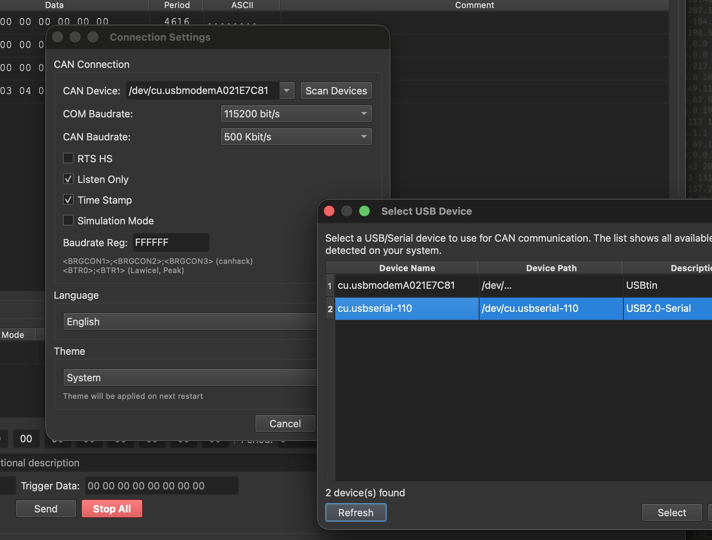
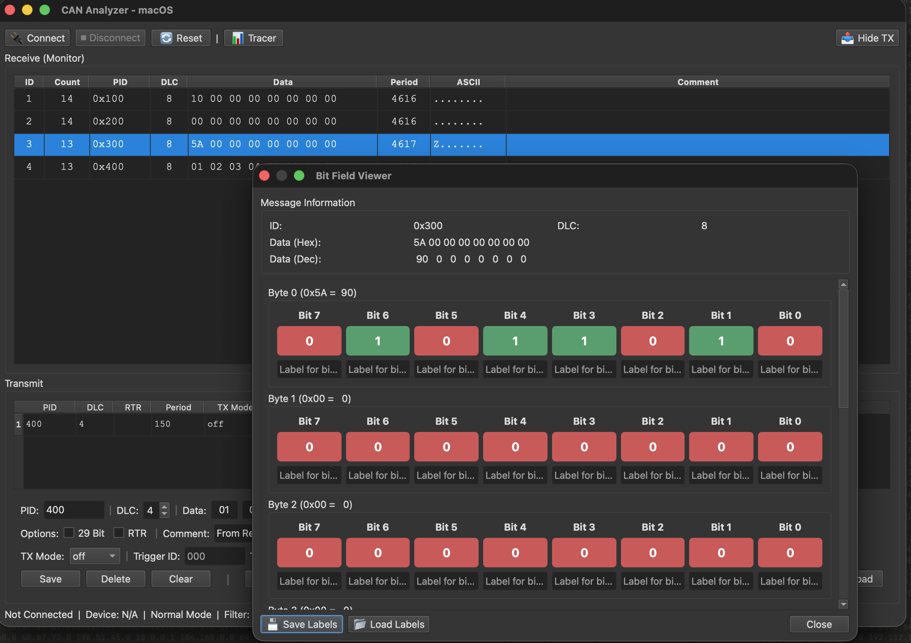

# CAN Analyzer

A CANbus analyzer with CANHacker-like functionality. Built with Python and PyQt6. **Runs on macOS and Linux.**

---

## Table of Contents

- [Quick Start](#quick-start)
- [Screenshots](#screenshots)
- [Supported Operating Systems](#supported-operating-systems)
- [Requirements](#requirements)
- [Features](#features)
- [Project Structure](#project-structure)
- [Hardware Support](#hardware-support)
- [Advanced Features](#advanced-features)
- [Configuration](#configuration)
- [Documentation](#documentation)
- [Troubleshooting](#troubleshooting)
- [Contributing](#contributing)
- [License](#license)
- [Project Status](#project-status)
- [Technical Notes](#technical-notes)

---

## Quick Start

**macOS / Linux:**
```bash
./run.sh
```

Or run manually:
```bash
python -m venv venv
source venv/bin/activate  # macOS/Linux
pip install -r requirements.txt
python can_analyzer_qt.py
```

---

## Screenshots

| | |
|:---:|:---:|
|  |  |
|  |  |

---

## Supported Operating Systems

| OS        | Status   | Notes |
|----------|----------|--------|
| **macOS**  | ✅ Supported | Use `/dev/cu.usbserial*` or `/dev/cu.usbmodem*`. (Packaged with **py2app**.) |
| **Linux**  | ✅ Supported | Use `/dev/ttyUSB*`, `/dev/ttyACM*`, or SocketCAN (`can0`, `vcan0`). (Packaged with **PyInstaller**.) |

- **PyQt6**, **python-can**, and **pyserial** are cross-platform.
- Device detection uses `pyserial` list_ports on all platforms.
- Serial (SLCAN) and SocketCAN interfaces are auto-detected from the channel name.

---

## Requirements

### Runtime Dependencies (included in packaged app)
- **Python 3.9+**
- **python-can** >= 4.3.1
- **pyserial** >= 3.5
- **PyQt6** >= 6.6.0

### System Requirements
- **macOS**: 10.14+ (for running from source) or any recent version (for .app bundle)
- **Linux**: Modern distribution with Python 3.9+ and Qt/GUI support


## Features

### Core Features

#### **Interface & Visualization**
- **Monitor Mode**: Groups messages by ID with counter
- **Tracer Mode**: Chronological list of all messages

#### **Message Reception**
- Reception panel with: ID, DLC, Data, Period, Count, ASCII, Comment
- **Monitor Mode**: Groups by ID, shows Count (first column), Period (ms between messages)
- **Tracer Mode**: Chronological list with timestamps

#### **Message Transmission**
- Complete CAN message configuration
- Support for 11 and 29-bit IDs
- RTR (Remote Transmission Request)
- Configurable transmission period
- TX Mode: off, on, trigger
- Trigger ID and Trigger Data for conditional transmission

#### **Advanced Features**
- **Bit Field Viewer**: Detailed bit-by-bit visualization
- **Software Filters**: Message filtering by ID and data
- **Trigger-based TX**: Automatic transmission on received messages
- **Playback**: Reproduce recorded traces


## Project Structure

```
can-bus-analyzer/
├── can_analyzer_qt.py          # Application entry point (run this to start the app)
├── can_analyzer.spec           # PyInstaller spec for Linux builds
├── setup.py                    # py2app configuration for macOS builds
├── requirements.txt            # Runtime Python dependencies (included in packaged app)
├── requirements-dev.txt        # Build and dev dependencies (py2app, PyInstaller, Pillow)
├── run.sh                      # Quick start: creates venv, installs deps, runs the app
├── config.json                 # Saved settings (created at first run)
├── icon.icns / icon.ico        # App icons (macOS / Linux); generated from icon.png via extras
├── docs/                       # Additional documentation
│   ├── BUILD.md                # Packaging and standalone build instructions
│   ├── INTERNATIONALIZATION.md # Adding and editing translations
│   ├── PROTOCOL.md             # CAN/protocol notes
│   └── TOOLS.md                # Overview of tools and scripts
├── extras/                     # Build and icon helper scripts (run from project root)
│   ├── build.sh                # Build standalone app (macOS or Linux)
│   └── create_icon.sh          # Generate icon.icns / icon.ico from a PNG
├── tools/                      # Testing and example scripts (see tools/README.md)
│   ├── README.md               # CAN testing tools and Arduino examples
│   ├── send_can_message.py     # Python script to send CAN messages
│   ├── arduino_msg_generator.ino
│   └── arduino_msg_receiver.ino
├── src/                        # Application source code
│   ├── __init__.py
│   ├── main_window.py          # Main window, reception/transmission UI, modes
│   ├── models.py               # Data models (CANMessage, CANFilter, TransmitMessage, etc.)
│   ├── dialogs_new.py          # Dialogs: Settings, Filters, Triggers, Bit Field Viewer
│   ├── file_operations.py      # Save/load logs and transmit lists (JSON, CSV, TRC)
│   ├── logger.py               # Logging to files and UI
│   ├── i18n.py                 # Internationalization (EN, PT, ES, DE, FR)
│   ├── utils.py                # Helpers (formatting, filtering)
│   ├── can_interface.py        # CAN bus connection and message send/receive
│   └── usb_device_monitor.py   # USB/serial device detection
└── logs/                       # Application log files (created at runtime)
```

---


## Hardware Support

### Supported CAN Adapters

- USB-CAN adapters (via python-can SLCAN)
- Serial CAN adapters (via pyserial)
- SocketCAN (Linux)
- Virtual CAN (vcan) for testing

### USB / Serial Device Detection (Cross-Platform)

The application includes **automatic device detection** on all supported OSes:

- **Scan Devices** in Settings: Opens device selection dialog
- **Auto-detection**: Monitors USB/serial connections in real-time
- **Hot-swap support**: Automatically disconnects if device is removed
- **Simulation Mode**: Test without hardware


**Device paths by OS:**

| OS      | Serial (SLCAN) examples      | SocketCAN |
|---------|------------------------------|-----------|
| **macOS**  | `/dev/cu.usbserial*`, `/dev/cu.usbmodem*` | — |
| **Linux**  | `/dev/ttyUSB0`, `/dev/ttyACM0`           | `can0`, `vcan0` |

### Connection Settings

Configure in **Settings** dialog (Ctrl+,):

**Device Configuration:**
- **CAN Device**: Select your adapter (e.g., `/dev/tty.usbserial`, `can0`)
- **COM Baudrate**: Serial communication speed (default: 115200 bps)
- **CAN Baudrate**: CAN bus speed (125K, 250K, 500K, 1000K)

**Operating Modes:**
- **Normal Mode**: Receive and Transmit messages
- **Listen Only**: Receive-only mode (no ACK transmission)
- **Simulation Mode**: Use simulated data instead of real hardware


## Advanced Features

### **Bit Field Viewer**

Inspect a received CAN message byte-by-byte and bit-by-bit. For each byte you see its value in hex and decimal, and each of the 8 bits (0 or 1) with color highlighting. You can attach custom labels to bits (e.g. "Engine ON", "Brake") and save/load them to JSON for documentation or decoding. Open it from the reception table context menu (right-click a message → Bit Field Viewer).

### **Software Filters**

Reduce clutter by showing only the messages you care about. Filters can be by **CAN ID** (whitelist or blacklist, with ranges like `0x300-0x310`) and by **data content** (byte index, value, and mask in hex). Enable/disable filters and configure them in **Filters** (Ctrl+F). Filtering is applied in real time to the reception panel.

### **Trigger-based TX**

Automatically send a CAN message when a specific message is received. You define a **trigger** (ID and optional data pattern); when a matching message appears on the bus, the app sends a configured **response message** (ID and data). Useful for automated replies, testing, or simulating ECUs. Configure in **Triggers** (Ctrl+G) and enable "Trigger-based Transmission".

### **Playback**

Replay previously recorded traffic back onto the bus. In **Tracer** mode, use **Record** to capture messages; then **Play All** or **Play Selected** sends them with the same timing. Requires an active connection. Use it to reproduce scenarios, test other nodes, or repeat a sequence without manual retyping.

---

## Configuration

### Configuration File

Settings are **automatically saved** to `config.json` in the application directory and persist across sessions:

**Location:** `./config.json`

**Format:**
```json
{
  "language": "en",
  "baudrate": 500000,
  "interface": "socketcan",
  "channel": "can0",
  "listen_only": true,
  "timestamp": true,
  "com_baudrate": "115200 bit/s",
  "rts_hs": false,
  "baudrate_reg": "FFFFFF"
}
```

**Manual editing:**
You can manually edit `config.json` if needed (application must be closed).

### Keyboard Shortcuts

| Action | Shortcut |
|--------|----------|
| Connect | `Ctrl+O` |
| Reset | `Ctrl+R` |
| Save Receive Log | `Ctrl+S` |
| Load Receive Log | `Ctrl+L` |
| Save Transmit List | `Ctrl+Shift+S` |
| Load Transmit List | `Ctrl+Shift+L` |
| Clear Receive | `Ctrl+K` |
| Tracer Mode | `Ctrl+T` |
| Filters | `Ctrl+F` |
| Triggers | `Ctrl+G` |
| Settings | `Ctrl+,` |
| Exit | `Ctrl+Q` |

---

## Documentation

Additional documentation and references:

| Document | Description |
|----------|-------------|
| [docs/BUILD.md](docs/BUILD.md) | Packaging and standalone build (py2app, PyInstaller, icons) |
| [docs/INTERNATIONALIZATION.md](docs/INTERNATIONALIZATION.md) | Internationalization (i18n): adding and editing translations |
| [docs/TOOLS.md](docs/TOOLS.md) | Overview of tools and scripts in the repository |
| [tools/README.md](tools/README.md) | CAN testing tools: Python sender, Arduino examples, protocol reference |


---

## Troubleshooting

### Application won't start

When running from source, verify the environment:

```bash
# Check Python version
python3 --version  # Should be 3.9+

# Recreate virtual environment
rm -rf venv
python3 -m venv venv
source venv/bin/activate
pip install -r requirements.txt
```

### CAN adapter not detected

1. Check device connection: `ls /dev/tty.*`
2. Verify permissions: `sudo chmod 666 /dev/tty.usbserial*`
3. Try simulation mode (no hardware needed)

### Language not changing

1. Ensure you selected language in Settings
2. **Restart the application** (required for full effect)
3. Check logs for errors: `grep "language\|idioma" logs/*.log`

### Messages not appearing

1. Check connection status (should show "Connected")
2. Verify CAN baudrate matches your network
3. Check software filters (disable if enabled)
4. Try clearing and reconnecting

---

## Contributing

Contributions are welcome! Here's how you can help:

### Adding Translations

1. Edit `src/i18n.py`
2. Add your language to `LANGUAGES`
3. Translate all keys in `TRANSLATIONS`
4. Test thoroughly
5. Submit PR

### Reporting Bugs

1. Check existing issues
2. Provide detailed description
3. Include log files (`logs/`)
4. Specify macOS version and Python version

### Feature Requests

1. Open an issue
2. Describe the feature
3. Explain use case

---

## License

This project is licensed under the **GNU General Public License v3.0 (GPL-3.0)**.

### What this means:

- **Freedom to use**: You can use this software for any purpose
- **Freedom to study**: You can study how the program works and modify it
- **Freedom to share**: You can redistribute copies of the software
- **Freedom to improve**: You can distribute modified versions

### Key terms:

- If you distribute this software, you must make the source code available
- Any modifications must also be licensed under GPL-3.0
- You must include the original copyright notice and license text
- There is NO WARRANTY for this software

**Attribution:** Although not required by GPL-3.0, we recommend that you **reference and credit the original source** (this project and repository) when you use, redistribute, or build upon this software.

**Full license text**: [GNU GPL v3.0](https://www.gnu.org/licenses/gpl-3.0.en.html)


---

## Project Status

**Version**: 0.1.0  
**Status**: Active  
**Last Updated**: January 2026

### Implemented Features
- Monitor & Tracer modes
- Message transmission
- File operations (save/load)
- Bit field viewer
- Software filters
- Trigger-based TX
- Playback functionality
- Multi-language support (5 languages)
- Comprehensive logging
- USB device auto-detection
- Hot-swap device support

### Planned Features
- Hardware filters (28 configurable)
- CAN Bomber (spoofing tool)
- Gateway mode (bridge two channels)
- Statistics & analytics
- DBC file support
- Real-time plotting
- Multiple CANbus devices


---

## Technical Notes

### CAN Protocol Implementation

The application uses `python-can` library which abstracts the CANHacker/Lawicel SLCAN protocol:

**Supported Interfaces:**
- **SLCAN** (Serial CAN): For USB-serial adapters implementing Lawicel protocol
- **SocketCAN**: Native Linux/macOS CAN interface
- **Virtual CAN**: For testing without hardware

**Why python-can?**
- Handles protocol complexity automatically
- Supports multiple CAN interfaces
- Cross-platform compatibility
- Active development and community support
- No need to implement low-level SLCAN commands manually

The application automatically detects the interface type based on the device path:
- `/dev/tty.*` or `/dev/cu.*` → SLCAN
- `can*` or `vcan*` → SocketCAN

---