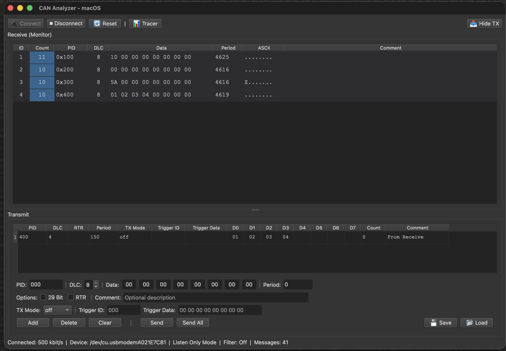
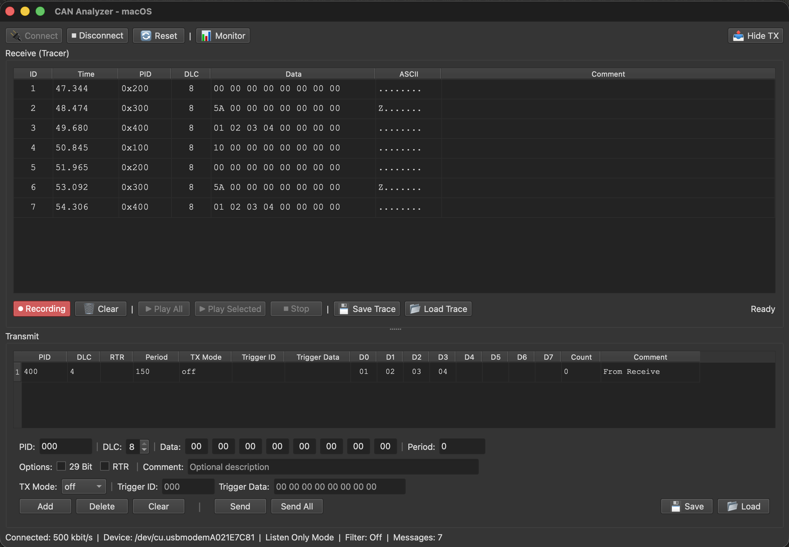
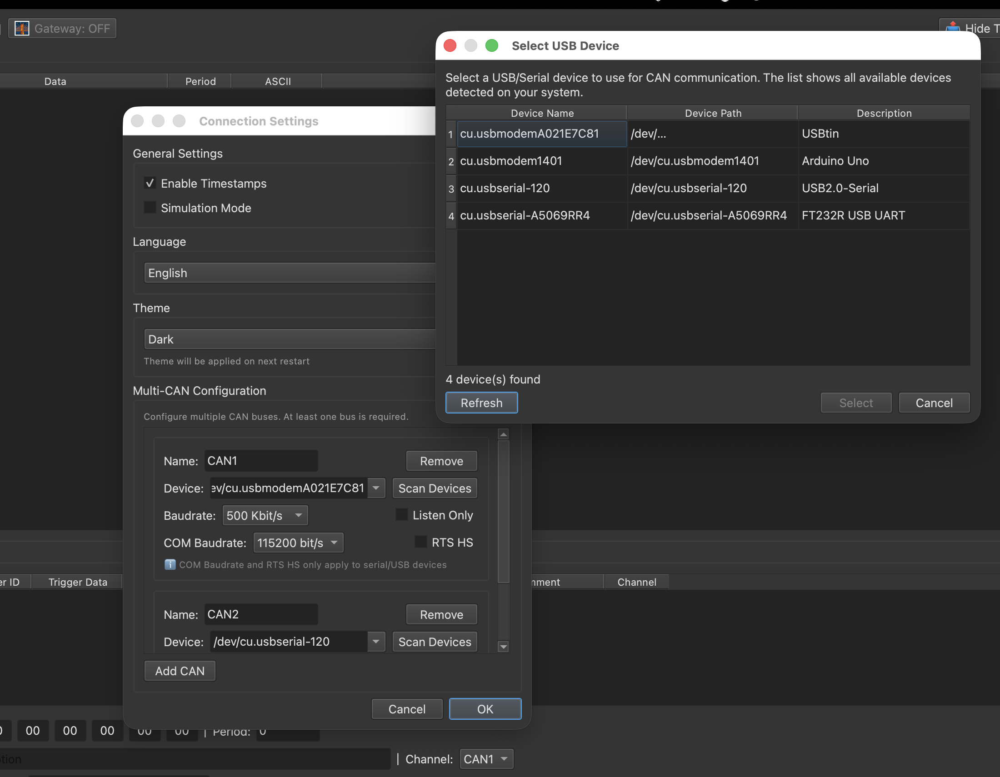
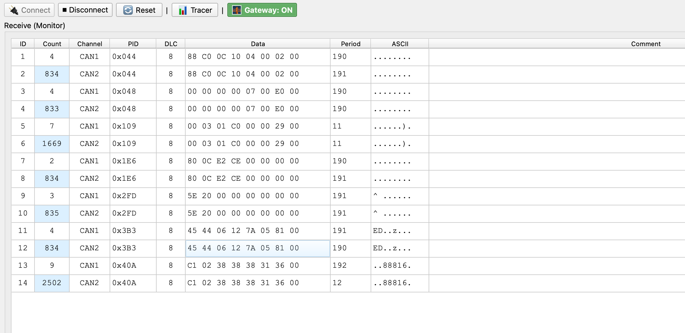
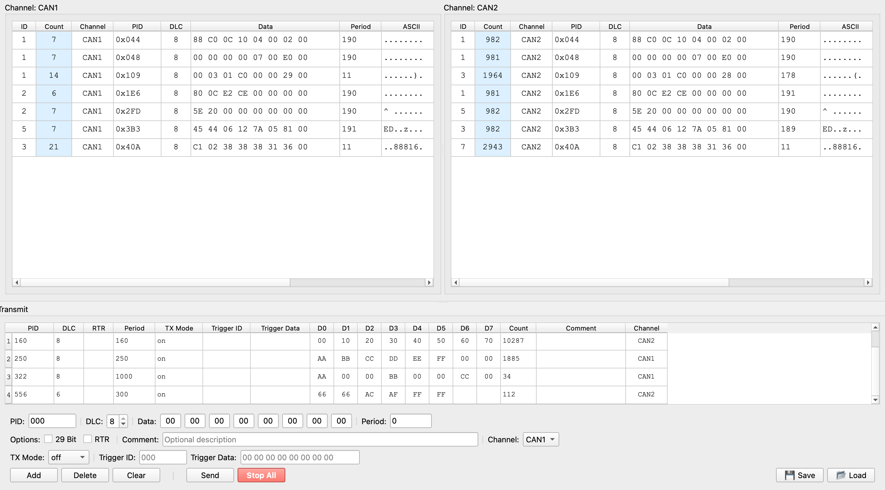
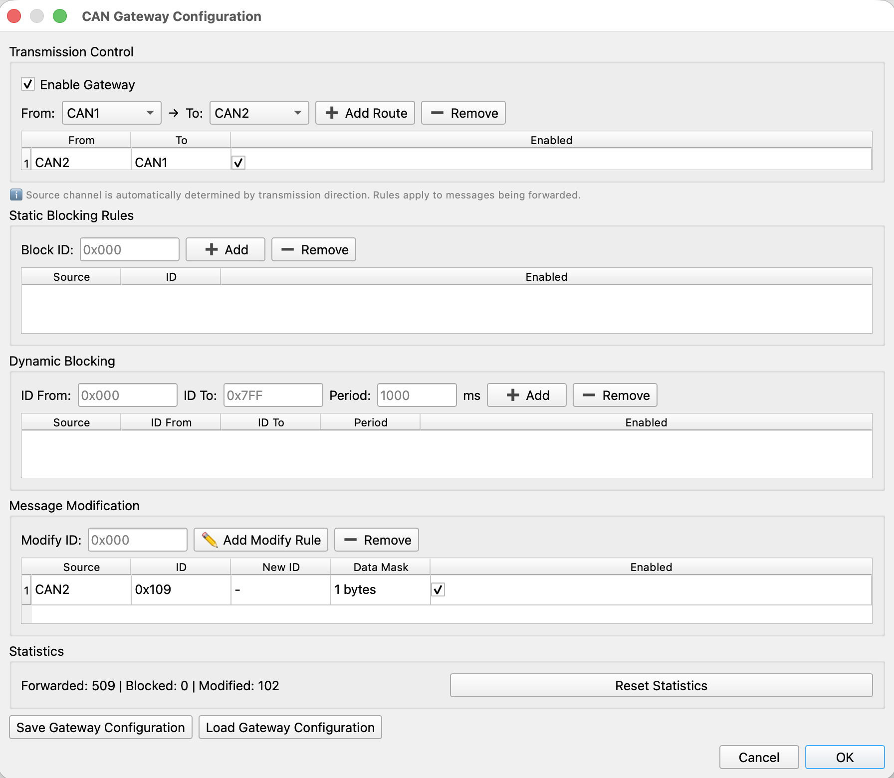
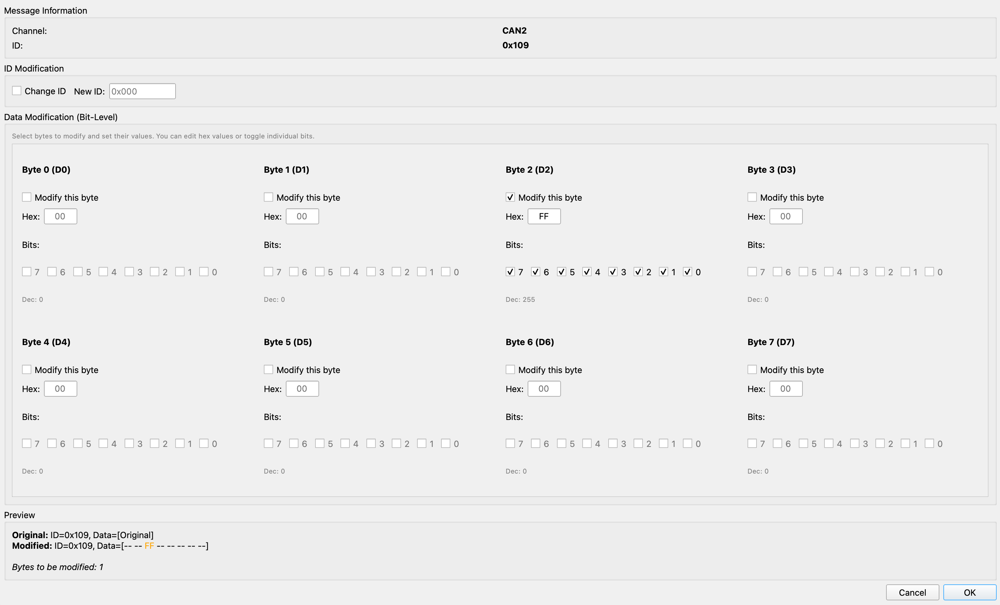

# CAN Analyzer

[](CHANGELOG.md)
[](LICENSE)

A comprehensive CAN bus analyzer with SLCAN support, protocol decoders, and real-time analysis. Built with Python and PyQt6. **Runs on macOS and Linux.**

---

## Table of Contents

- [Quick Start](#quick-start)
- [Screenshots](#screenshots)
- [Supported Operating Systems](#supported-operating-systems)
- [Requirements](#requirements)
- [Features](#features)
- [Protocol Decoders](#protocol-decoders)
- [Project Structure](#project-structure)
- [Hardware Support](#hardware-support)
- [Advanced Features](#advanced-features)
- [Usability](#usability)
- [Configuration](#configuration)
- [Documentation](#documentation)
- [Tools & Utilities](#tools--utilities)
- [Troubleshooting](#troubleshooting)
- [Contributing](#contributing)
- [Changelog](#changelog)
- [License](#license)
- [Project Status](#project-status)
- [Technical Notes](#technical-notes)

---

## Quick Start

**macOS / Linux:**
```bash
./run.sh
```

Or run manually:
```bash
python -m venv venv
source venv/bin/activate  # macOS/Linux
pip install -r requirements.txt
python can_analyzer.py
```

---

## Screenshots

### Monitor & Tracer Modes
| | |
|:---:|:---:|
|  |  |
| *Monitor Mode - Grouped by ID* | *Tracer Mode - Chronological List* |

### Configuration & Tools
| | |
|:---:|:---:|
|  |  |
| *Multi-CAN Bus Configuration* | *Bit Field Viewer* |

### Split-Screen Monitor (Dual Channel View)
| | |
|:---:|:---:|
|  |  |
| *Split-Screen + Transmit Panel* | *Split-Screen (TX Hidden)* |
|  |  |
| *Multi-CAN Without Split* | *Split-Screen Channel Selection Dialog* |
|  |  |
| *Split-Screen + Active Transmission* | *Tracer Mode with Multi-CAN* |

### CAN Gateway (Message Routing & Modification)
| | |
|:---:|:---:|
|  |  |
| *Gateway Basic Configuration* | *Bit-Level Message Modification* |
|  | |
| *Original vs Modified Message Result* | |

---

## Supported Operating Systems

| OS        | Status   | Notes |
|----------|----------|--------|
| **macOS**  | ✅ Supported | Use `/dev/cu.usbserial*` or `/dev/cu.usbmodem*`. (Packaged with **py2app**.) |
| **Linux**  | ✅ Supported | Use `/dev/ttyUSB*`, `/dev/ttyACM*`, or SocketCAN (`can0`, `vcan0`). (Packaged with **PyInstaller**.) |

- **PyQt6**, **python-can**, and **pyserial** are cross-platform.
- Device detection uses `pyserial` list_ports on all platforms.
- Serial (SLCAN) and SocketCAN interfaces are auto-detected from the channel name.

---

## Requirements

### Runtime Dependencies (included in packaged app)
- **Python 3.9+**
- **python-can** >= 4.3.1
- **pyserial** >= 3.5
- **PyQt6** >= 6.6.0

### System Requirements
- **macOS**: 10.14+ (for running from source) or any recent version (for .app bundle)
- **Linux**: Modern distribution with Python 3.9+ and Qt/GUI support

---

## Features

### Core Features

#### **Interface & Visualization**
- **Monitor Mode**: Groups messages by (ID, Channel) with counter
- **Tracer Mode**: Chronological list of all messages
- **Multi-CAN Support**: Work with multiple CAN buses simultaneously
- **Split-Screen Mode**: View messages from different channels side-by-side

#### **Message Reception**
- Reception panel with: ID, DLC, Data, Period, Count, ASCII, Comment
- **Monitor Mode**: Groups by ID, shows Count (first column), Period (ms between messages)
- **Tracer Mode**: Chronological list with timestamps
- **Protocol Decoders**: Automatic decoding of FTCAN 2.0 and OBD-II messages

#### **Message Transmission**
- Complete CAN message configuration
- Support for 11 and 29-bit IDs
- RTR (Remote Transmission Request)
- Configurable transmission period
- TX Mode: off, on, trigger
- Trigger ID and Trigger Data for conditional transmission

#### **Advanced Features**
- **Bit Field Viewer**: Detailed bit-by-bit visualization
- **Software Filters**: Message filtering by ID and data
- **Trigger-based TX**: Automatic transmission on received messages
- **Playback**: Reproduce recorded traces
- **CAN Gateway**: Bridge and filter messages between buses
- **Protocol Decoders**: FTCAN 2.0 and OBD-II support

---

## Protocol Decoders

The CAN Analyzer includes **modular protocol decoders** for automatic message interpretation:

### FTCAN 2.0 (FuelTech CAN Protocol)

**Description:** Proprietary protocol from FuelTech for ECUs and sensors.

**Features:**
- **Broadcast Protocol**: Automatic transmission; ECUs use 4 priority streams (Critical, High, Medium, Low)
- **29-bit Extended IDs**: Product ID, Data Field, Message ID
- **100+ Measures**: Lambda, RPM, TPS, MAP, temperatures, pressures, injection, ignition
- **Supported Devices**: WB-O2 Nano (wideband), FT500/FT600 ECUs, FTSwitchPanel (button/LED), EGT-8 (exhaust gas temperature)
- **Bitrate**: 1 Mbps (fixed) — required for FTCAN
- **Byte Order**: Big-endian; segmented ECU streams use reverse byte order during reassembly

**Interface — FTCAN Analyzer** (shortcut: **Ctrl+1** or Tools → FTCAN 2.0 Analyzer):
- **Live Measures** (first tab): Real-time sensor values; best for monitoring
- **Decoded Messages**: Full decoding of each frame; product-type filter and auto-scroll; may be slower under high message load
- **Diagnostics**: Stream statistics (per-priority message/measure counts, update rate) and device list

**Usability:** Open the FTCAN Analyzer only after connecting at 1 Mbps, or use Simulation mode. For high traffic, use the product filter (e.g. “O2 Sensors” or “ECUs”) to reduce clutter.

**Documentation:**
- [FTCAN Protocol & Decoder Documentation](docs/decoders/FTCAN.md) — Protocol, ECU streams, SwitchPanel, EGT-8, implementation
- [Official FuelTech Specification](https://files.fueltech.net/manuals/Protocol_FTCAN20_Public_R026.pdf)

**Tools:**
- `tools/ftcan/ftcan_simulator.py` — Message simulator for testing
- `tools/ftcan/ftcan_config_capture.py` — Configuration capture tool

---

### OBD-II (On-Board Diagnostics II)

**Description:** Standardized automotive diagnostic protocol (ISO 15765-4).

**Features:**
- **Request/Response Protocol**: Polling required for data access
- **11-bit Standard IDs**: 0x7DF (request), 0x7E8-0x7EF (responses)
- **60+ PIDs**: Engine, fuel, air intake, lambda/O2 sensors, advanced parameters
- **Services**: Current data, freeze frame, DTCs, vehicle info
- **Bitrate**: 500 kbps (most common) or 250 kbps
- **Byte Order**: Big-endian
- **Universal**: Works with all vehicles 1996+ (US/EU/Japan)

**Interface:**
- **OBD-II Monitor** (Ctrl+Shift+O): Dedicated UI for OBD-II diagnostics
  - PID Selection: Choose parameters to monitor
  - Quick Presets: Basic, Extended, Lambda, Fuel
  - Automatic Polling: Configurable interval (100ms-10s)
  - Live Values: Real-time data display
  - DTC Reading: Read and decode diagnostic trouble codes
  - Raw Messages: Request/response log
  - Statistics: Success rate, response time

**Documentation:**
- [OBD-II Protocol Documentation](docs/decoders/OBD2.md) - Complete technical specification
- [ISO 15765-4 Standard](https://www.iso.org/standard/66574.html)
- [SAE J1979 Standard](https://www.sae.org/standards/content/j1979_201702/)
- [Wikipedia: OBD-II PIDs](https://en.wikipedia.org/wiki/OBD-II_PIDs)

**Tools:**
- `tools/general/obd2_poller.py` - CLI polling tool
- `tools/arduino/arduino_obd2_ecu_simulator.ino` - Arduino ECU simulator

---

### Protocol Decoder Manager

**Access:** Tools → Protocol Decoders → Manage Decoders (Ctrl+Shift+D)

**Features:**
- Enable/disable decoders independently
- View decoding statistics (decoded/failed messages)
- Configure decoder priority
- Reset statistics

**Automatic Decoding:**
- Messages are automatically identified and decoded when decoders are active
- Decoded information appears in tooltips and dedicated interfaces
- Multiple decoders can be active simultaneously

---

## Project Structure

```
can-bus-analyzer/
├── can_analyzer.py             # Application entry point (run this to start the app)
├── can_analyzer.spec           # PyInstaller spec for Linux builds
├── setup.py                    # py2app configuration for macOS builds
├── requirements.txt            # Runtime Python dependencies (included in packaged app)
├── requirements-dev.txt        # Build and dev dependencies (py2app, PyInstaller, Pillow)
├── run.sh                      # Quick start: creates venv, installs deps, runs the app
├── LICENSE                     # GNU GPL v3.0 (see License section)
├── config.json                 # Saved settings (created at first run)
├── icon.icns / icon.ico        # App icons (macOS / Linux); generated from icon.png via extras
├── docs/                       # Documentation
│   ├── images/                 # Screenshots and app images (used in README)
│   ├── BUILD.md                # Packaging and standalone build instructions
│   ├── INTERNATIONALIZATION.md # Adding and editing translations
│   ├── RELEASE_MANUAL.md       # How to create a release manually on GitHub
│   ├── TOOLS.md                # Overview of tools and scripts
│   ├── ftcan/                  # FTCAN protocol documentation
│   │   └── README.md           # Complete FTCAN 2.0 specification
│   └── decoders/               # Protocol decoder documentation
│       ├── FTCAN.md            # FTCAN decoder implementation details
│       └── OBD2.md             # OBD-II decoder implementation details
├── extras/                     # Build and icon helper scripts (run from project root)
│   ├── build.sh                # Build standalone app (macOS or Linux)
│   └── create_icon.sh          # Generate icon.icns / icon.ico from a PNG
├── tools/                      # Testing and utility scripts
│   ├── README.md               # Overview of all tools
│   ├── general/                # General CAN tools
│   │   ├── README.md           # Documentation for general tools
│   │   ├── send_can_message.py # Send CAN messages via command line
│   │   ├── baudrate_detect.py  # Auto-detect CAN baudrate
│   │   └── obd2_poller.py      # OBD-II polling tool
│   ├── arduino/                # Arduino examples and simulators
│   │   ├── README.md           # Arduino tools documentation
│   │   ├── arduino_msg_generator.ino # CAN message generator
│   │   ├── arduino_msg_receiver.ino  # CAN message receiver
│   │   └── arduino_obd2_ecu_simulator.ino # OBD-II ECU simulator
│   └── ftcan/                  # FTCAN-specific tools
│       ├── README.md           # FTCAN tools documentation
│       ├── ftcan_simulator.py  # FTCAN message simulator
│       └── ftcan_config_capture.py # Configuration capture tool
├── src/                        # Application source code
│   ├── __init__.py
│   ├── main_window.py          # Main window, reception/transmission UI, modes (orchestrator)
│   ├── models.py               # Data models (CANMessage, CANFilter, TransmitMessage, etc.)
│   ├── dialogs.py              # General dialogs: Settings, Filters, Triggers, Bit Field Viewer
│   ├── dialogs_ftcan.py        # FTCAN Analyzer dialog (Live Measures, Decoded Messages, Diagnostics)
│   ├── dialogs_obd2.py         # OBD-II Monitor dialog
│   ├── file_operations.py      # Save/load logs and transmit lists (JSON, CSV, TRC)
│   ├── logger.py               # Logging to files and UI
│   ├── i18n.py                 # Internationalization (EN, PT, ES, DE, FR)
│   ├── utils.py                # Helpers (formatting, filtering)
│   ├── can_interface.py        # CAN bus connection and message send/receive
│   ├── can_bus_manager.py      # Multi-CAN bus management
│   ├── config_manager.py       # Configuration file management
│   ├── protocol_decoder.py     # Protocol decoder base class
│   ├── theme.py                # UI theme management
│   ├── usb_device_monitor.py   # USB/serial device detection
│   ├── config/                 # Centralized configuration
│   │   ├── shortcuts.py       # Keyboard shortcuts (platform-aware)
│   │   └── ...
│   ├── handlers/               # Business logic (connection, playback, filters, gateway, etc.)
│   │   ├── connection_manager.py
│   │   ├── playback_handler.py
│   │   ├── recording_handler.py
│   │   ├── filter_manager.py
│   │   ├── dialog_manager.py
│   │   ├── ui_state_manager.py
│   │   ├── gateway_manager.py
│   │   ├── transmit_handler.py
│   │   ├── file_handler.py
│   │   └── ...
│   ├── ui/                     # Reusable UI components
│   │   ├── menu_bar.py         # Menu bar builder
│   │   ├── table_helpers.py    # Table formatting helpers
│   │   ├── receive_table.py    # Receive table component
│   │   └── ...
│   └── decoders/               # Protocol decoders
│       ├── __init__.py
│       ├── base.py             # Decoder base and manager
│       ├── decoder_ftcan.py    # FTCAN core (streams, measures, SwitchPanel, EGT-8)
│       ├── adapter_ftcan.py    # FTCAN protocol adapter
│       ├── decoder_obd2.py     # OBD-II core decoder
│       └── adapter_obd2.py     # OBD-II protocol adapter
└── logs/                       # Application log files (created at runtime)
```

---

## Hardware Support

### Supported CAN Adapters

- USB-CAN adapters (via python-can SLCAN)
- Serial CAN adapters (via pyserial)
- SocketCAN (Linux)
- Virtual CAN (vcan) for testing

### USB / Serial Device Detection (Cross-Platform)

The application includes **automatic device detection** on all supported OSes:

- **Scan Devices** in Settings: Opens device selection dialog
- **Auto-detection**: Monitors USB/serial connections in real-time
- **Hot-swap support**: Automatically disconnects if device is removed
- **Simulation Mode**: Test without hardware

**Device paths by OS:**

| OS      | Serial (SLCAN) examples      | SocketCAN |
|---------|------------------------------|-----------|
| **macOS**  | `/dev/cu.usbserial*`, `/dev/cu.usbmodem*` | — |
| **Linux**  | `/dev/ttyUSB0`, `/dev/ttyACM0`           | `can0`, `vcan0` |

### Connection Settings

Configure in **Settings** dialog (Ctrl+,):

**Device Configuration:**
- **CAN Device**: Select your adapter (e.g., `/dev/tty.usbserial`, `can0`)
- **COM Baudrate**: Serial communication speed (default: 115200 bps)
- **CAN Baudrate**: CAN bus speed (125K, 250K, 500K, 1M)

**Operating Modes:**
- **Normal Mode**: Receive and Transmit messages
- **Listen Only**: Receive-only mode (no ACK transmission)
- **Simulation Mode**: Use simulated data instead of real hardware

---

## Advanced Features

### **Bit Field Viewer**

Inspect a received CAN message byte-by-byte and bit-by-bit. For each byte you see its value in hex and decimal, and each of the 8 bits (0 or 1) with color highlighting. You can attach custom labels to bits (e.g. "Engine ON", "Brake") and save/load them to JSON for documentation or decoding. Open it from the reception table context menu (right-click a message → Bit Field Viewer).

### **Software Filters**

Reduce clutter by showing only the messages you care about. Filters can be by **CAN ID** (whitelist or blacklist, with ranges like `0x300-0x310`) and by **data content** (byte index, value, and mask in hex). Enable/disable filters and configure them in **Filters** (Ctrl+F). Filtering is applied in real time to the reception panel.

### **Trigger-based TX**

Automatically send a CAN message when a specific message is received. You define a **trigger** (ID and optional data pattern); when a matching message appears on the bus, the app sends a configured **response message** (ID and data). Useful for automated replies, testing, or simulating ECUs. Configure in **Triggers** (Ctrl+G) and enable "Trigger-based Transmission".

### **Playback**

Replay previously recorded traffic back onto the bus. In **Tracer** mode, use **Record** to capture messages; then **Play All** or **Play Selected** sends them with the same timing. Requires an active connection. Use it to reproduce scenarios, test other nodes, or repeat a sequence without manual retyping.

### **CAN Gateway**

Bridge and filter messages between two CAN buses. The Gateway feature allows you to:

- **Bidirectional Transmission**: Control message flow from CAN1→CAN2 and/or CAN2→CAN1
- **Static Blocking**: Block specific message IDs on specific channels
- **Dynamic Blocking**: Automatically cycle through a range of IDs, blocking each for a specified period
- **Message Modification**: Modify message IDs and data bytes as they pass through the gateway
- **Statistics**: Track forwarded, blocked, and modified messages in real-time

**How to Use:**

1. Configure at least 2 CAN buses in Settings
2. Open **Tools → Gateway** (Ctrl+W)
3. Enable Gateway and configure transmission direction
4. Add blocking rules or dynamic blocks as needed
5. Monitor statistics to verify gateway operation

**Use Cases:**
- Isolate two CAN networks while selectively forwarding messages
- Test ECU behavior by blocking specific messages
- Simulate gateway ECUs in automotive systems
- Debug multi-network vehicle architectures

### **Split-Screen Monitor**

View messages from different CAN channels simultaneously in a split-screen layout.

**How to Use:**

1. Configure at least 2 CAN buses in Settings
2. Enable **View → Split-Screen Mode** (Ctrl+D)
3. Select which channel to display in each panel (left/right)
4. Messages are automatically filtered by channel

**Benefits:**
- Compare message traffic between two networks
- Monitor gateway operation in real-time
- Analyze timing differences between channels
- Simplify multi-network debugging

### **Multi-CAN Support**

Work with multiple CAN buses simultaneously. Configure up to multiple CAN interfaces (e.g., two USB adapters, or one adapter with multiple channels) and monitor/transmit on all of them at once.

#### **Configuration**

1. Open **Settings** (Ctrl+,)
2. Navigate to **Multi-CAN Configuration** section
3. For each CAN bus:
   - **Name**: Identifier for the bus (e.g., "CAN1", "CAN2", "Engine", "Body")
   - **Device**: Physical device path (e.g., `/dev/ttyUSB0`, `can0`, `/dev/cu.usbserial-1`)
   - **Baudrate**: CAN bus speed (125k, 250k, 500k, 1000k, or custom)
   - **Listen Only**: Enable for passive monitoring (no ACK, no transmission)
   - **COM Baudrate**: Serial port speed for SLCAN adapters (115200, 230400, etc.)
   - **RTS HS**: Hardware handshake for serial adapters
4. Click **Add CAN** to add more buses
5. Use **Scan Devices** to auto-detect available devices
6. Click **OK** to save

#### **Interface Auto-Detection**

The application automatically detects the interface type based on the device name:
- **SocketCAN**: `can0`, `can1`, `vcan0` → uses `socketcan` interface
- **SLCAN**: `/dev/ttyUSB*`, `/dev/cu.usbserial*` → uses `slcan` interface

#### **Usage**

**Monitor/Tracer:**
- Messages from all connected buses appear in the reception table
- **Channel** column shows which bus received each message (CAN1, CAN2, etc.)
- Messages are grouped by **(ID, Channel)** in Monitor mode
- Each (ID, Channel) combination has independent counters and period tracking

**Transmit:**
- Select target **Channel** from dropdown in TX panel
- Send messages to specific bus or broadcast to all
- TX list saves the channel for each message

**Status Bar:**
- Shows detailed status for each channel:
  - **Real mode**: `CAN1: ✓ 500k | CAN2: ✓ 250k` (✓ = connected, ✗ = failed)
  - **Simulation mode**: `CAN1: SIM 500k | CAN2: SIM 250k`
- Device info shows mapping: `CAN1→/dev/ttyUSB0 | CAN2→can0`

#### **Use Cases**

- **Multi-network vehicles**: Monitor engine CAN and body CAN simultaneously
- **Gateway testing**: Send on one bus, verify on another
- **Dual-adapter setups**: Use two USB-CAN adapters for isolated testing
- **Channel comparison**: Compare same ID on different buses
- **Protocol mixing**: FTCAN on one bus, OBD-II on another

---

## Usability

Tips for day-to-day use and common workflows.

### General

- **Connect before protocol tools:** For **FTCAN Analyzer**, connect to the bus first (or enable Simulation mode). FTCAN requires **1 Mbps**; if no bus is at 1 Mbps, the analyzer will show a clear message.
- **Simulation mode:** In **Settings**, enable “Simulation Mode” to run without hardware. Useful for learning the UI, testing filters/triggers, and trying decoders.
- **Multi-CAN:** To use **Gateway** or **Split-Screen**, configure at least two CAN buses in **Settings** and connect.

### FTCAN Analyzer

- **Live Measures** is the first tab: use it for real-time sensor values (lambda, RPM, etc.).
- **Decoded Messages** can be slower under very high message rates; a note appears next to “Auto-Decode”. Use the **product type filter** (e.g. “O2 Sensors”, “ECUs”) to reduce rows and improve responsiveness.
- **Auto-scroll** in Decoded Messages can be turned on/off; status (cache, workers) is shown at the bottom-left of the dialog.
- **Diagnostics** tab shows stream statistics (messages/measures per priority) and devices.

### Keyboard Shortcuts (Platform)

- On **macOS**, the shortcut modifier is **Command (⌘)** for the actions in the table (the app uses Qt’s “Ctrl” for both Command on macOS and Control on Windows/Linux).
- Shortcuts are centralized in `src/config/shortcuts.py` and can be adjusted there.

### Saving and Loading

- **Receive:** Save/Load Monitor or Tracer log (JSON, CSV, or trace format) from the File menu or toolbar.
- **Transmit:** Save/Load the transmit list (JSON) to reuse message sets.
- **Settings** (including multi-CAN and theme) are stored in `config.json` and persist between runs.

---

## Configuration

### Configuration File

Settings are **automatically saved** to `config.json` in the application directory and persist across sessions:

**Location:** `./config.json`

**Format:**
```json
{
  "language": "en",
  "theme": "system",
  "timestamp": true,
  "simulation_mode": false,
  "can_buses": [
    {
      "name": "CAN1",
      "channel": "/dev/ttyUSB0",
      "baudrate": 500000,
      "interface": "slcan",
      "listen_only": false,
      "com_baudrate": "115200 bit/s",
      "rts_hs": false
    },
    {
      "name": "CAN2",
      "channel": "can0",
      "baudrate": 250000,
      "interface": "socketcan",
      "listen_only": true
    }
  ]
}
```

**Legacy single-CAN format** is still supported for backward compatibility:
```json
{
  "language": "en",
  "baudrate": 500000,
  "channel": "can0",
  "listen_only": true
}
```

**Manual editing:**
You can manually edit `config.json` if needed (application must be closed).

### Keyboard Shortcuts

On **macOS**, the modifier is shown and works as **Command (⌘)**. Shortcuts are centralized in `src/config/shortcuts.py` and can be adjusted there.

| Action | Shortcut |
|--------|----------|
| Connect | `Ctrl+O` |
| Reset | `Ctrl+R` |
| Save Receive Log | `Ctrl+Shift+M` |
| Load Receive Log | `Ctrl+Alt+M` |
| Save Tracer Log | `Ctrl+S` |
| Load Tracer Log | `Ctrl+Alt+L` |
| Save Transmit List | `Ctrl+Shift+S` |
| Load Transmit List | `Ctrl+Alt+T` |
| Clear Receive | `Ctrl+K` |
| Tracer Mode | `Ctrl+T` |
| Filters | `Ctrl+F` |
| Triggers | `Ctrl+Alt+G` |
| Gateway | `Ctrl+Shift+W` |
| Split-Screen Mode | `Ctrl+Alt+D` |
| **FTCAN Analyzer** | `Ctrl+1` |
| **OBD-II Monitor** | `Ctrl+2` |
| **Decoder Manager** | `Ctrl+Shift+D` |
| Settings | `Ctrl+,` |
| Exit | `Ctrl+Q` |

---

## Documentation

### Main Documentation

| Document | Description |
|----------|-------------|
| [docs/BUILD.md](docs/BUILD.md) | Packaging and standalone build (py2app, PyInstaller, icons) |
| [docs/INTERNATIONALIZATION.md](docs/INTERNATIONALIZATION.md) | Internationalization (i18n): adding and editing translations |
| [docs/RELEASE_MANUAL.md](docs/RELEASE_MANUAL.md) | How to create a release manually on GitHub |
| [docs/TOOLS.md](docs/TOOLS.md) | Overview of tools and scripts in the repository |

### Protocol Documentation

| Document | Description |
|----------|-------------|
| [docs/decoders/FTCAN.md](docs/decoders/FTCAN.md) | **FTCAN 2.0** — Protocol, ECU 4-stream broadcast, SwitchPanel, EGT-8, decoder implementation |
| [docs/decoders/OBD2.md](docs/decoders/OBD2.md) | **OBD-II Protocol** — Complete technical specification |

### Tools Documentation

| Document | Description |
|----------|-------------|
| [tools/README.md](tools/README.md) | Overview of all testing and utility tools |
| [tools/general/README.md](tools/general/README.md) | General CAN tools (send, baudrate detect, OBD-II poller) |
| [tools/arduino/README.md](tools/arduino/README.md) | Arduino examples and simulators (CAN, OBD-II) |
| [tools/ftcan/README.md](tools/ftcan/README.md) | FTCAN-specific tools (simulator, config capture) |

---

## Tools & Utilities

### General CAN Tools

**Location:** `tools/general/`

- **send_can_message.py** - Send CAN messages via command line
- **baudrate_detect.py** - Auto-detect CAN baudrate (trial and error)
- **obd2_poller.py** - OBD-II polling tool with interactive PID selection

**Documentation:** [tools/general/README.md](tools/general/README.md)

### Arduino Tools

**Location:** `tools/arduino/`

- **arduino_msg_generator.ino** - CAN message generator (MCP2515)
- **arduino_msg_receiver.ino** - CAN message receiver (MCP2515)
- **arduino_obd2_ecu_simulator.ino** - OBD-II ECU simulator with animated data

**Documentation:** [tools/arduino/README.md](tools/arduino/README.md)

### FTCAN Tools

**Location:** `tools/ftcan/`

- **ftcan_simulator.py** - FTCAN message simulator (WB-O2 Nano, ECU)
- **ftcan_config_capture.py** - Capture and replay configuration commands

**Documentation:** [tools/ftcan/README.md](tools/ftcan/README.md)

---

## Troubleshooting

### Application won't start

When running from source, verify the environment:

```bash
# Check Python version
python3 --version  # Should be 3.9+

# Recreate virtual environment
rm -rf venv
python3 -m venv venv
source venv/bin/activate
pip install -r requirements.txt
```

### CAN adapter not detected

1. Check device connection: `ls /dev/tty.*`
2. Verify permissions: `sudo chmod 666 /dev/tty.usbserial*`
3. Try simulation mode (no hardware needed)

### Language not changing

1. Ensure you selected language in Settings
2. **Restart the application** (required for full effect)
3. Check logs for errors: `grep "language\|idioma" logs/*.log`

### Messages not appearing

1. Check connection status (should show "Connected")
2. Verify CAN baudrate matches your network
3. Check software filters (disable if enabled)
4. Try clearing and reconnecting

### Protocol Decoder Issues

**FTCAN not decoding:**
1. Verify baudrate is exactly **1 Mbps** (required for FTCAN)
2. Connect to the bus before opening FTCAN Analyzer, or use Simulation mode
3. Check that FTCAN decoder is enabled (Decoder Manager: Ctrl+Shift+D)
4. Open FTCAN Analyzer (Ctrl+1) and check the **Diagnostics** tab for stream/device info
5. Ensure messages use 29-bit Extended IDs

**FTCAN Decoded Messages tab slow:**
- At high message rates the Decoded Messages tab can be slower; use the **product type filter** (e.g. O2 Sensors, ECUs) to reduce rows. Prefer the **Live Measures** tab for real-time values.

**OBD-II not responding:**
1. Verify baudrate is 500 kbps (or 250 kbps)
2. Turn vehicle ignition to ON position
3. Check that OBD-II decoder is enabled (Ctrl+Shift+D)
4. Open OBD-II Monitor (Ctrl+Shift+O) and try "Check Available PIDs"
5. Increase polling interval to 500-1000ms

---

## Contributing

Contributions are welcome! Here's how you can help:

### Adding Translations

1. Edit `src/i18n.py`
2. Add your language to `LANGUAGES`
3. Translate all keys in `TRANSLATIONS`
4. Test thoroughly
5. Submit PR

### Reporting Bugs

1. Check existing issues
2. Provide detailed description
3. Include log files (`logs/`)
4. Specify OS version and Python version

### Feature Requests

1. Open an issue
2. Describe the feature
3. Explain use case

---

## Changelog

See [CHANGELOG.md](CHANGELOG.md) for detailed version history and release notes.

**Latest Release: v1.0.0** - First Stable Release with Protocol Decoders
- **FTCAN 2.0 Protocol Decoder**: Automatic decoding of FuelTech devices
- **OBD-II Protocol Decoder**: Universal automotive diagnostics support
- **FTCAN Analyzer**: Dedicated UI for FTCAN messages with live measures
- **OBD-II Monitor**: Interactive PID selection, polling, and DTC reading
- **Protocol Decoder Manager**: Enable/disable decoders, view statistics
- **Comprehensive Documentation**: Complete technical specs for FTCAN and OBD-II
- **Testing Tools**: Arduino OBD-II simulator, FTCAN simulator, OBD-II poller
- **Improved Architecture**: Modular decoder system (core + adapter pattern)
- **File Reorganization**: Decoders in `src/decoders/`, improved project structure

**Previous Releases:**

**v0.4.0** - Protocol Decoders & Enhanced Documentation
- FTCAN 2.0 and OBD-II protocol decoders
- Dedicated protocol analyzer UIs
- Comprehensive technical documentation

**v0.3.0** - CAN Gateway & Split-Screen
- CAN Gateway for bridging and filtering between two CAN buses
- Split-Screen Monitor for side-by-side channel viewing
- Static and dynamic message blocking
- Message modification capabilities
- Real-time gateway statistics
- Complete internationalization support

---

## License

This project is licensed under the **GNU General Public License v3.0 (GPL-3.0)**.

### What this means:

- **Freedom to use**: You can use this software for any purpose
- **Freedom to study**: You can study how the program works and modify it
- **Freedom to share**: You can redistribute copies of the software
- **Freedom to improve**: You can distribute modified versions

### Key terms:

- If you distribute this software, you must make the source code available
- Any modifications must also be licensed under GPL-3.0
- You must include the original copyright notice and license text
- There is NO WARRANTY for this software

**Attribution:** Although not required by GPL-3.0, we recommend that you **reference and credit the original source** (this project and repository) when you use, redistribute, or build upon this software.

**Full license text**: [LICENSE](LICENSE) (in this repo) · [GNU GPL v3.0](https://www.gnu.org/licenses/gpl-3.0.en.html) (official)

---

## Project Status

**Version**: 1.0.0  
**Status**: Stable  
**Last Updated**: February 2026

### Implemented Features
- Monitor & Tracer modes
- Message transmission
- File operations (save/load)
- Bit field viewer
- Software filters
- Trigger-based TX
- Playback functionality
- Multi-language support (5 languages)
- Comprehensive logging
- USB device auto-detection
- Hot-swap device support
- Multi-CAN support (multiple buses simultaneously)
- Per-channel filters and improved terminology (Channel/Device)
- CAN Gateway (bridge and filter between buses)
- Split-Screen Monitor (dual channel view)
- **FTCAN 2.0 Protocol Decoder** (FuelTech devices)
- **OBD-II Protocol Decoder** (universal automotive diagnostics)
- **Protocol Decoder Manager** (enable/disable, statistics)
- **FTCAN Analyzer** (dedicated FTCAN UI)
- **OBD-II Monitor** (interactive diagnostics UI)

### Recently Added / Updated
- **FTCAN 2.0**: ECU 4-stream broadcast decoding, SwitchPanel (buttons/LED), EGT-8 support; Live Measures as primary tab; product filter and diagnostics
- **Usability**: Centralized shortcuts (`src/config/shortcuts.py`), usability section in README, FTCAN tips (1 Mbps, filters, performance)
- **Architecture**: Handlers (`src/handlers/`) and UI components (`src/ui/`), config module (`src/config/`) for maintainability
- **Documentation**: [FTCAN.md](docs/decoders/FTCAN.md) updated with streams, reverse byte order, WB-O2 vs ECU, EGT-8; SwitchPanel viewer in `tools/ftcan/`

### Planned Features
- Hardware filters (28 configurable)
- CAN Bomber (spoofing tool)
- Statistics & analytics
- DBC file support
- Real-time plotting
- Additional protocol decoders (J1939, CANopen)

---

## Technical Notes

### CAN Protocol Implementation

The application uses `python-can` library which abstracts the Lawicel SLCAN protocol:

**Supported Interfaces:**
- **SLCAN** (Serial CAN): For USB-serial adapters implementing Lawicel protocol
- **SocketCAN**: Native Linux/macOS CAN interface
- **Virtual CAN**: For testing without hardware

**Why python-can?**
- Handles protocol complexity automatically
- Supports multiple CAN interfaces
- Cross-platform compatibility
- Active development and community support
- No need to implement low-level SLCAN commands manually

The application automatically detects the interface type based on the device path:
- `/dev/tty.*` or `/dev/cu.*` → SLCAN
- `can*` or `vcan*` → SocketCAN

### Protocol Decoder Architecture

**Modular Design:**
- **Core Decoder** (`*_decoder.py`): Pure decoding logic, protocol-specific
- **Protocol Adapter** (`*_protocol_decoder.py`): Integration with app, wraps core decoder
- **Base Class** (`protocol_decoder.py`): Abstract interface for all decoders

**Benefits:**
- Easy to add new protocols
- Clean separation of concerns
- Testable decoder logic
- Consistent API for all protocols

**Supported Protocols:**
- **FTCAN 2.0**: FuelTech proprietary (1 Mbps, 29-bit, broadcast)
- **OBD-II**: ISO 15765-4 (500 kbps, 11-bit, request/response)

---

**Ready to analyze CAN traffic? Start with `./run.sh` or explore the [documentation](docs/)!** 
